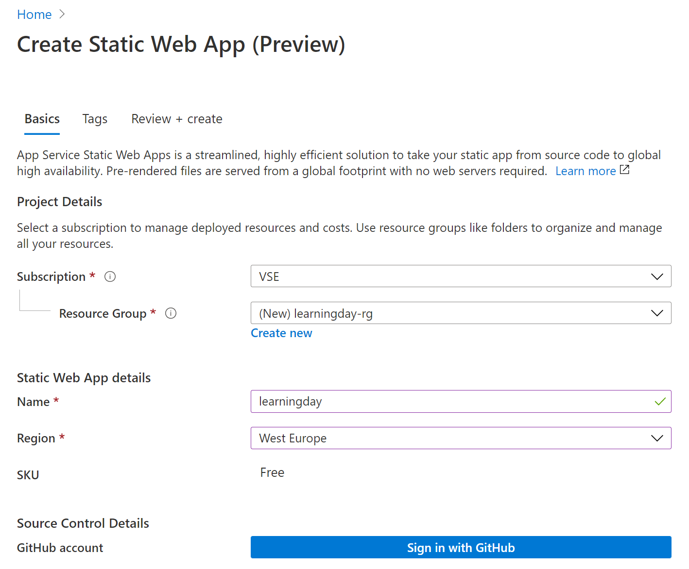

# Microsoft UK Learning Day DevOps WorkShop (September 24th 2020)

By the end of this workshop, you will have a blog running in Azure, deployed by GitHub Actions.  You will use core DevOps practices like continuous integration and continuous deployment to deploy new blog posts in a safe, repeatable and timely manner! 

This workshops requires no prior knowledge of git, GitHub or Azure. 


## Pre-reqs

1. Azure Visual Studio Subscription enabled
1. GitHub Account

## Step 1 - Set up your workspace

Codespaces are... TODO

1. Visit https://aka.ms/vso-login to log in and get started. You will need to use the identity you used when creating your Visual Studio Subscription.

1. If you have never used Codespaces before, you'll need to create a plan. Click on **Create Codespace** to create a billing plan. 

    

1. Choose your Visual Studio Subscription and leave the location on West Europe. You can leave Advanced Options on their defaults. Click **Create**.
    <br>
    

1. Now you can create your Codespace. Give it a name, and then paste in the following link in the **Git Repository** field. 
    <br>
    ```
    https://github.com/gohugoio/hugo.git
    ```

    Leave everything else on their default settings. Click **Create**.
    <br>
        
    After a few moments, you should see your new Codespace ready to go! 

    

Let's spend a moment exploring the menu. If you have spent time using VS Code before and are comfortable, feel free to skip to the next step - [Setup Hugo](#Step-2).

todo.. vscode intro


## Step 2 - Setup Hugo

[Hugo](https://gohugo.io/) is a static site generator. A static site contains web pages with fixed content, and displays the same content to every user who visits the web page. Generally, static sites are made up of HTML pages that are stored as files in a file system somewhere. They can utilise CSS for styling and Javascript for more complex features like page transitions, menus and buttons.

Dynamic sites work differently. They generate their content based on making a database request. Think about a site like Netflix.com. You can log in, and you will see your library of favourite shows and movies to watch. Those are generated dynamically, and will be different for every user.

###### A History Lesson

Back in the early days of the web, static sites were prevalent. [Geocities, anyone?!](https://www.geocitiesarchive.org/index.html)

As time passed and e-commerce become more prevalent, dynamic sites backed by databases became the norm, allowing users to log into websites, place orders and write reviews. 

Static sites have had a resurgence over the last few years, especially with the entrance of static site generators. They make it really very easy to build your static site. They basically run a script that takes your content (in today's example, a blog post), combines that data with templates and outputs a folder with all of the HTML and assets you need to publish your site.

There are major advantages to using static sites.

- They are seriously fast to load (it's just HTML!)
- They are cheap to host (no database or backend server necessary)
- They are easy to backup and deploy (it's just HTML!)

Back to Hugo. It's open source, extremely popular, and it has a bunch of templates that you can use to really customise and make your website your own. Let's get started with it now.

1. Open a new terminal in VS Code by clicking on the hamburger menu icon and selecting Terminal > New Terminal.

    <br>
    

1. Run the following command in the terminal that just opened at the bottom of your screen.

    ```
    go install --tags extended
    ```
    
    

    We are simply installing Hugo to our Codespace environment with this command. You will see a lot of scrolling text for a minute or two. Wait for this to complete, and then add Hugo to your path by typing the below command.

    ```
    export PATH=/go/bin:$PATH
    ```

    Verify the installation has been successful by typing the below:

    ```
    hugo version
    ```

    If successful, you will see the below image:

    


## Step 3 - Create a Hugo website

1. Create a new website by typing the following command into your terminal.
    ```
    hugo new site static-blog
    ```
    You should get a "Congratulations!" message: 
    <br>
    
    <br>
1. Next, let's add a theme to the website.
    
    ```
    cd static-blog
    git init
    git submodule add https://github.com/budparr/gohugo-theme-ananke.git themes/ananke
    ```

    The first command changes directory into the static site folder. The second command initiliazes this folder as a Git repository. The third command adds a reference to a specific theme for Hugo, which can be found in another Github repository. 
    <br>
    
    <br>

    We need to add our theme to a configuration file, which lets Hugo know what we want the site to look like:

    ```
    echo 'theme = "ananke"' >> config.toml
    ```
1. So far we have typed a bunch of commands. You have enough at this point to actually check out what your website looks like. Type one more command:

    ```
    hugo server -D
    ```
    

What is really cool about Codespaces is that we can actually visit your site through the magic of port forwarding! Your website is now running inside your Codespace. Click on the link in your terminal to visit it.


## Step 4 - Setup GitHub

1. In your Codespace terminal, type:

    ```
    git status
    ```
    

    This is a useful command, and one to use often. It tells us a few things about our Git repository. 

    - We are on the master branch
    - We haven't made any commits yet
    - We have changes that need to be committed
    - We have untracked files

    Todo: insert guidance on branches, commits, tracking files.

1. In your Codespace terminal, type each command below. Be sure to replace your email and your name.

    ```
    git config --global user.email "you@example.com"
    git config --global user.name "Your Name"
    git add .
    git commit -m 'adding my static site files'
    ```
    What you have done here is asked git to track those files and folders that are necessary to build your static site. You have also configured git to use your name and email, so any commit you make can be traced back to you. 

    

    Now we have git configured locally, we need to create a repository to host our code. We shouldn't rely on keeping our code locally or in a Codespace.

1. Open up a new browser and type **repo.new** - this is actually a domain owned by GitHub that gives us a nice shortcut to create a new repo! You may be prompted to log in or create an account.

1. Create a new repo called learningday - but don't initialize it yet (we are going to push our existing repository instead).

    

    Once you hit the screen below, go back to your Codespace.

    

1. Copy the below commands into your Codespace terminal, replacing **youraccount** with your GitHub account name.

    ```
    git remote add origin https://github.com/youraccount/learningday.git
    git push -u origin master
    ```
    You will be prompted to authorize Codespaces with your GitHub account - go ahead and do this.

    

    Afterwards, you should see all of your files in the remote repo:

    


## Step 5 - Publish your static site

Now that we have the barebones of your website, and a repo hosting your code, you need somewhere to publish that code to.

Azure Static Web Apps is a service that automatically builds and deploys web apps to Azure from a GitHub repository.

1. Navigate to http://portal.azure.com and log in.
1. On the homepage, search for **Static Web Apps** and click on the marketplace icon.
    
1. Fill in the following details:

    - Subscription: Choose your **Visual Studio Subscription**
    - Resource Group:Create a new one called **learningday-rg**
    - Static Web App Name: **learning day**
    - Region: **West Europe**
        
1. Click on **Sign in with GitHub** and authorise connection.
1. Fill in the following details:
**
    - Organisation: **Your GitHub Account name**
    - Repository: **learningday**
    - Branch: **master**
    - Build Presets: **Hugo**
    - App Location: **/**
    - Api Location: **Leave this blank**
    - App artifact location: **public**

    

1. Click **Review + create**

1. Head back to your GitHub repo and refresh the page. You will see a new folder in your repo called **.github/workflows**
    

    When you created the static web app just now, Azure pushed a new commit to our repo which contained a file called **azure-static-web-apps-yourappname.yml**. 

    This is a [workflow](https://docs.github.com/en/actions/configuring-and-managing-workflows) file, and it contains all the instructions needed to build and deploy your static web app to Azure. 
    
    [GitHub Actions](https://docs.github.com/en/actions) uses these files to build end-to-end continuous integration (CI) and continuous deployment (CD) capabilities directly in your repository.

1. Click on the **Actions** tab in your repo. You might see that that the workflow is still running. Click on it to view the live logs.

    

    In this example, the workflow is on the **Build and Deploy** job. 

    

    Wait for the workflow to successfully complete.

1. Go back to Azure and find your recently deployed static web app. You can search **Static Web App** in the search bar of the Azure Portal if you can't find it. Once found, click on it and find the URL of your web app (it's in the far right of the screenshot below).

1. Click on it, and you should see your empty blog. Time to update it!

    

## Step 6 - Use CI & CD to update the blog

Continuous integration is..

Continuous deployment is.. 

1. Go back to your Codespace terminal.

    >Note: If your Codespace has timed out, make sure you change directory back into static-blog by typing **cd static-blog**.

1. Create a new post by typing the following:
    ```
    hugo new posts/my-first-post.md
    ```

1. Find the file you just created in the file explorer to the left. It will be in **static-blog/content/posts**.
    

1. Set draft: false and write some text below the second ---. Once you are finished, save the post by typing Ctrl + S.

1. Find the config.toml (it will be in the root of your static-blog folder) and change the title name to whatever you want it to be, then save it with Ctrl + S.
    

1. In your terminal, type:

    ```
    git pull
    ```
    This command pulls down any changes from our remote repo into our local repo. You will see that the .github folder now exists locally, along with your workflow file. 

    Always do a git pull before a git push!

1. In your terminal, type: 
    ```
    git add .
    ```
    Remember, this commands adds any new or untracked files we created to git. 

1. Now we can practice continuous integration! We have made changes locally, so we can now commit and push those to our GitHub repo. Type:

    ```
    git commit -m "added my first blog post"
    ```
1. Go back to your GitHub repo and observe the updated files. You should now see a content/posts directory which Hugo created for you locally when you created your first post.

    

1. Click on **Actions** to observe your workflow running for a second time. You can see that the workflow tell us that it is linked to the commit we just made (added my first blog post). Optionally, click on it to view the logs again.

    

1. Finally, once the workflow completes successfully, refresh your static web app. You should see an updated title and your first post!

    

### Wrap Up - What have I learned?

ToDo

##### Encourage people to share their first blog post on LinkedIn & Twitter with a #LearningDay? 

##### Could have a Logic App triggering on when it detects a new post 

